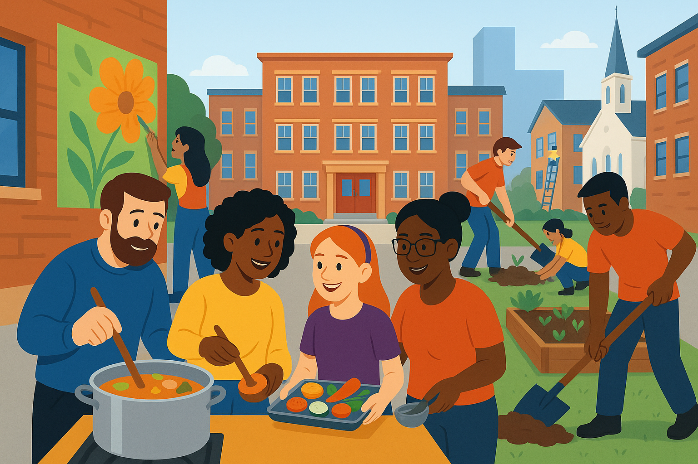

 

# High-School-Next
A suite of courses and tools for transforming high school.

We honor what science has to say about learning. We use modern tools for collaborative development. We recognize that the US has 30,000 high schools, and 17,000 high school students from a vast array of backgrounds and communities.

We do this via the system of Industry Recognized Credentials, plus Ohio's Credit Flexibility option.
* [Industry Recognized Credentials (Ohio)](https://education.ohio.gov/Topics/Ohio-s-Graduation-Requirements/Contacts-and-Resources/Industry-Recognized-Credentials/Industry-Recognized-Credentials-by-Career-Field)
* [Advancing Ohio's Credit Flexibility Plan](https://prezi.com/v70tyr1h7t19/advancing-ohios-credit-flexibility-plan/)

##The Plan

[Redesign High School IRC Development Program.pdf](https://github.com/High-School-Remixed/High-School-Next/blob/main/Redesign%20High%20School%20IRC%20Development%20Program.pdf)
